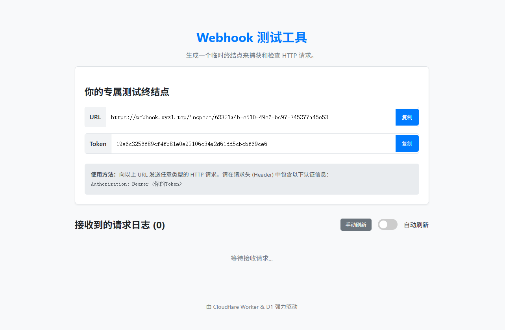

# Webhook Tester on Cloudflare Workers & D1

这是一个完全构建在 Cloudflare 生态系统上的无服务器 Webhook 测试工具。它可以生成唯一的 URL 和 Token，用于捕获、检查和验证 HTTP 请求，是开发和调试 Webhook 集成的理想选择。

* [English Version](./README.en.md) (Coming soon)


## ✨ 功能特性

* **⚡️ 快速部署**: 无需本地环境，通过 Cloudflare 网页端操作，几分钟内即可完成部署。
* **🔗 专属终结点**: 即时生成唯一的 URL 和 Secret Token 用于接收和验证请求。
* **📄 实时日志**: 在网页上实时查看接收到的请求，包含详细的请求头、请求体、IP地址等信息。
* ** 控制面板**: 用户可以自主控制日志是否自动刷新，或选择手动获取，提供了灵活的使用体验。
* **🛡️ Token 验证**: 自动验证请求中的 `Authorization: Bearer <token>` 是否正确，并在界面上明确标识。
* **🧠 智能轮询**: 利用页面可见性 API (Page Visibility API)，当页面在后台非激活状态时，自动暂停日志轮询，节省资源。
* **⚙️ 自动化运维**: 集成 Cron 触发器，自动清理过期的请求日志和终结点，无需人工维护数据库。
* **🔧 高度可配置**: 通过环境变量轻松配置日志和终结点的保留天数，适应不同需求。
* **☁️ 100% Serverless**: 完全基于 Cloudflare Workers 和 D1 数据库，享受高性能、高可用性，并充分利用免费额度。

## 🚀 技术栈

* **后端/计算**: [Cloudflare Workers](https://workers.cloudflare.com/)
* **数据库**: [Cloudflare D1](https://developers.cloudflare.com/d1/) (基于 SQLite)
* **前端**: 原生 JavaScript, HTML, CSS (无框架)
* **定时任务**: Cloudflare Cron Triggers

## 🛠️ 部署指南 (网页端)

本项目无需使用命令行工具，所有操作均可在 Cloudflare 仪表盘完成。

### 第 1 步：创建 Worker

1.  登录 Cloudflare，进入 **Workers & Pages** 菜单。
2.  点击 **Create application** -> **Create Worker**。
3.  为您的 Worker 命名 (例如 `webhook-tester`) 并点击 **Deploy**。
4.  部署后，点击 **Edit code**，将本项目 `index.js` 中的所有代码完整地粘贴到编辑器中，替换掉默认代码。
5.  点击 **Save and deploy**。

### 第 2 步：创建 D1 数据库

1.  在左侧主菜单中，找到并点击 **D1**。
2.  点击 **Create database**，为数据库命名 (例如 `webhook-tester-db`) 并创建。

### 第 3 步：初始化数据表

1.  进入刚创建的 D1 数据库的管理页面，点击 **Console** 选项卡。
2.  复制下面的 SQL 命令，粘贴到控制台并执行，以创建所需的两个数据表。

    ```sql
    CREATE TABLE endpoints (
        id TEXT PRIMARY KEY,
        token_hash TEXT NOT NULL,
        created_at TEXT NOT NULL
    );

    CREATE TABLE received_requests (
        id INTEGER PRIMARY KEY AUTOINCREMENT,
        endpoint_id TEXT NOT NULL,
        timestamp TEXT NOT NULL,
        method TEXT NOT NULL,
        headers TEXT NOT NULL,
        body TEXT,
        ip_address TEXT,
        is_token_valid INTEGER NOT NULL,
        FOREIGN KEY (endpoint_id) REFERENCES endpoints(id) ON DELETE CASCADE
    );
    ```

### 第 4 步：绑定数据库到 Worker

1.  返回到您的 Worker 管理页面 (**Workers & Pages** -> 点击您的 Worker)。
2.  进入 **Settings** -> **Variables** 选项卡。
3.  向下滚动到 **D1 Database Bindings** 部分，点击 **Add binding**。
4.  按如下配置进行绑定：
    * **Variable name**: `DB`
    * **D1 database**: 选择您在第 2 步中创建的数据库 (`webhook-tester-db`)。
5.  点击 **Save**。Worker 将自动重新部署以应用绑定。

### 第 5 步：设置自动清理任务 (Cron Trigger)

1.  在 Worker 管理页面，进入 **Triggers** 选项卡。
2.  向下滚动到 **Cron Triggers** 部分，点击 **Add Cron Trigger**。
3.  在 **Cron expression** 输入框中，填入 `0 5 * * *`。
    * 这表示任务将在每天 UTC 时间的早上 5 点执行。您可以根据需要调整。
4.  点击 **Add trigger** 保存。

## ⚙️ 配置项

您可以通过环境变量来调整日志和终结点的自动清理周期，无需修改代码。

在 Worker 的 **Settings** -> **Variables** -> **Environment Variables** 部分，点击 **Add variable** 添加：

| 环境变量名    | 描述                                     | 代码内置默认值 |
| :------------ | :--------------------------------------- | :------------- |
| `LOG_DAYS`      | 请求日志的保留天数。超过此时长的日志将被删除。 | `1` (天)         |
| `ENDPOINT_DAYS` | 终结点的保留天数。超过此时长的终结点及其所有关联日志将被删除。 | `7` (天)         |

设置后，点击 **Save and deploy** 即可生效。如果未设置环境变量，代码将使用内置的默认值。

## 📜 开源许可

本项目基于 [MIT License](./LICENSE) 开源。
